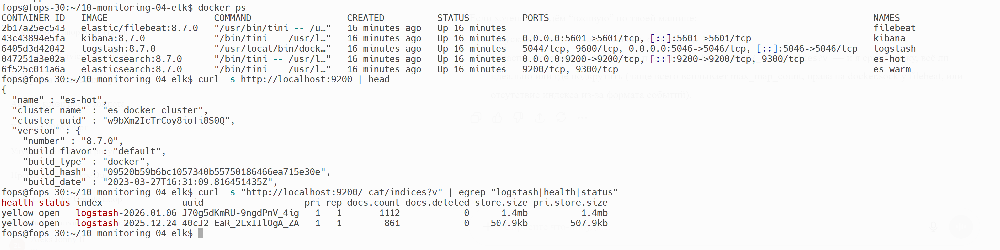
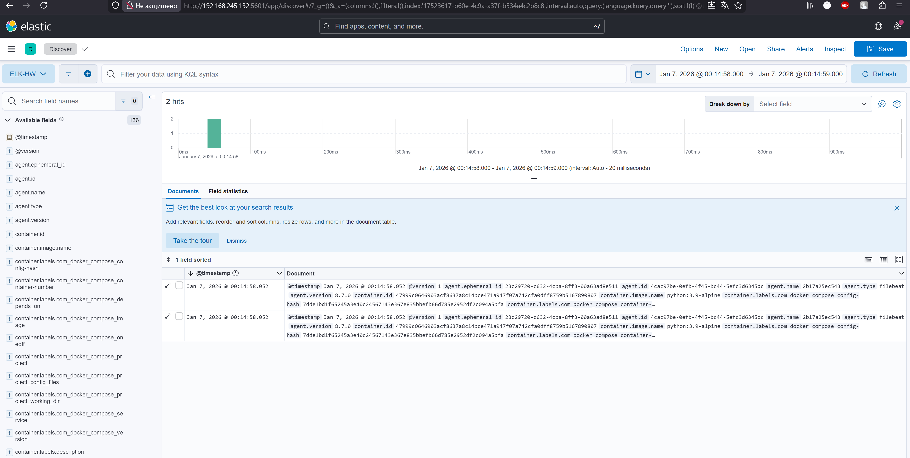

# Домашнее задание к занятию 15 «Система сбора логов Elastic Stack»

---



---



---


---

#### docker-compose манифест
```
version: "2.2"

services:
  es-hot:
    image: elasticsearch:8.7.0
    container_name: es-hot
    environment:
      - node.name=es-hot
      - cluster.name=es-docker-cluster
      - discovery.seed_hosts=es-hot,es-warm
      - cluster.initial_master_nodes=es-hot,es-warm
      - node.roles=master,data_content,data_hot
      - "ES_JAVA_OPTS=-Xms512m -Xmx512m"
      - "http.host=0.0.0.0"
      - xpack.security.enabled=false
    volumes:
      - data01:/usr/share/elasticsearch/data:Z
    ulimits:
      memlock: { soft: -1, hard: -1 }
      nofile:  { soft: 65536, hard: 65536 }
    ports:
      - "9200:9200"
    networks: [elastic]
    depends_on: [es-warm]

  es-warm:
    image: elasticsearch:8.7.0
    container_name: es-warm
    environment:
      - node.name=es-warm
      - cluster.name=es-docker-cluster
      - discovery.seed_hosts=es-hot,es-warm
      - cluster.initial_master_nodes=es-hot,es-warm
      - node.roles=master,data_warm
      - "ES_JAVA_OPTS=-Xms512m -Xmx512m"
      - xpack.security.enabled=false
      - "http.host=0.0.0.0"
    volumes:
      - data02:/usr/share/elasticsearch/data:Z
    ulimits:
      memlock: { soft: -1, hard: -1 }
      nofile:  { soft: 65536, hard: 65536 }
    networks: [elastic]

  kibana:
    image: kibana:8.7.0
    container_name: kibana
    ports:
      - "5601:5601"
    environment:
      ELASTICSEARCH_URL: http://es-hot:9200
      ELASTICSEARCH_HOSTS: '["http://es-hot:9200","http://es-warm:9200"]'
    networks: [elastic]
    depends_on: [es-hot, es-warm]

  logstash:
    image: logstash:8.7.0
    container_name: logstash
    environment:
      - "LS_JAVA_OPTS=-Xms256m -Xmx256m"
    ports:
      - "5046:5046"
    volumes:
      - ./configs/logstash.conf:/usr/share/logstash/pipeline/logstash.conf:Z
      - ./configs/logstash.yml:/opt/logstash/config/logstash.yml:Z
    networks: [elastic]
    depends_on: [es-hot, es-warm]

  filebeat:
    image: elastic/filebeat:8.7.0
    container_name: filebeat
    privileged: true
    user: root
    command: ["filebeat","-e","-strict.perms=false"]
    volumes:
      - ./configs/filebeat.yml:/usr/share/filebeat/filebeat.yml:Z
      - /var/lib/docker:/var/lib/docker:Z
      - /var/run/docker.sock:/var/run/docker.sock:Z
    networks: [elastic]
    depends_on: [logstash]

  some_app:
    image: python:3.9-alpine
    container_name: some_app
    volumes:
      - ./pinger/:/opt/:Z
    entrypoint: ["python3","/opt/run.py"]
    networks: [elastic]

volumes:
  data01: {}
  data02: {}

networks:
  elastic:
    driver: bridge
```
---

#### yml-конфигурации для стека

###### filebeat.yml
```yml
filebeat.inputs:
  - type: container
    paths:
      - /var/lib/docker/containers/*/*.log

processors:
  - add_docker_metadata:
      host: "unix:///var/run/docker.sock"

  - decode_json_fields:
      fields: ["message"]
      target: "json"
      overwrite_keys: true

output.logstash:
  hosts: ["logstash:5046"]
  protocol: tcp

logging.json: true
logging.metrics.enabled: false
```

---

###### logstash.conf
```conf
input {
  beats {
    port => 5046
  }
}

filter {
  if [json] and [json] =~ "^{.*}$" {
    json { source => "json" }
  }
}

output {
  elasticsearch {
    hosts => ["es-hot:9200"]
    index => "logstash-%{+YYYY.MM.dd}"
  }
}
```

---

###### logstash.yml
```yml
http.host: "0.0.0.0"
```
